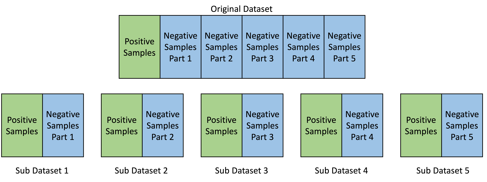

# Humana-Competition
Predicting the Likelihood of Receiving Vaccines Using an Ensembling of CatBoost and TabNet Approach

In this competition, we used the ensemble of TabNet and CatBoost. This is an already oversampled imbalanced dataset, 17% of the total sample are positive samples. In other words, the ratio of the number of positive samples to negative samples is 1:5. To solve this problem, we used methods that are similar to down-sampling. We randomly split all the negative samples into 5 parts and for each part, we combine it with all the positive samples.

  

